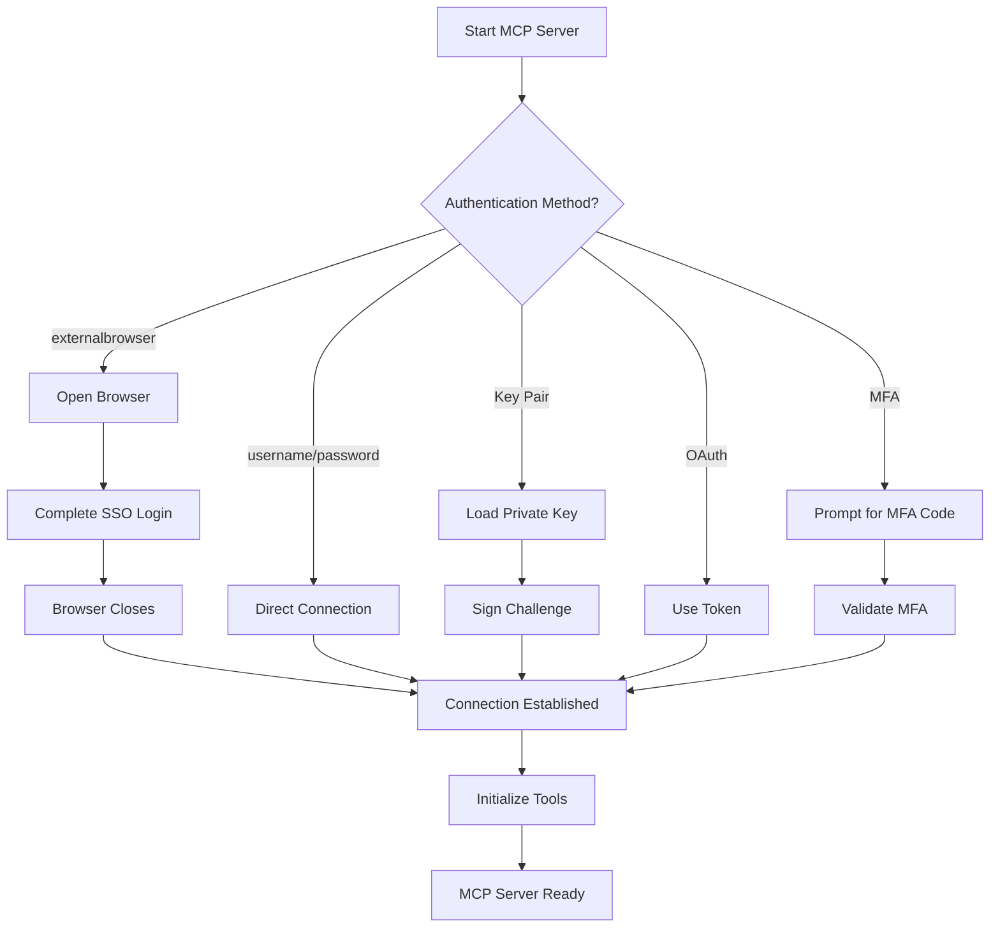

# Authentication Methods

The Snowflake MCP Server supports multiple authentication methods to connect to your Snowflake account. Choose the method that best fits your organization's security requirements and setup.

## Supported Authentication Methods

### 1. External Browser (SSO/SAML) ✨ **Recommended for Enterprise**

Use this method if your organization uses SSO (Single Sign-On) with providers like Okta, Azure AD, or other SAML 2.0 compliant identity providers.

#### Configuration

**CLI:**
```bash
snowflake-mcp-minimal \
  --account your-account \
  --user your-username \
  --authenticator externalbrowser \
  --service-config-file configs/minimal.yaml
```

**Environment Variables:**
```bash
export SNOWFLAKE_ACCOUNT=your-account
export SNOWFLAKE_USER=your-username
export SNOWFLAKE_AUTHENTICATOR=externalbrowser
export SERVICE_CONFIG_FILE=configs/minimal.yaml

snowflake-mcp-minimal
```

**Claude Desktop Config:**
```json
{
  "mcpServers": {
    "snowflake-sso": {
      "command": "uv",
      "args": [
        "--directory", "/path/to/snowflake-mcp",
        "run", "snowflake-mcp-minimal",
        "--authenticator", "externalbrowser",
        "--service-config-file", "configs/minimal.yaml"
      ],
      "env": {
        "SNOWFLAKE_ACCOUNT": "your-account",
        "SNOWFLAKE_USER": "your-username",
        "SNOWFLAKE_WAREHOUSE": "your-warehouse",
        "SNOWFLAKE_ROLE": "your-role"
      }
    }
  }
}
```

#### How It Works
1. Server starts and attempts connection
2. **Browser automatically opens** to your organization's SSO login page
3. Complete authentication in the browser (SAML, Azure AD, etc.)
4. Browser closes automatically after successful authentication
5. MCP server establishes connection

#### Requirements
- ✅ **Account**: Required
- ✅ **User**: Required  
- ❌ **Password**: Not needed (will be ignored)
- ❌ **Private Key**: Not needed (will be ignored)

### 2. Username/Password Authentication

Basic authentication using Snowflake username and password.

#### Configuration

**CLI:**
```bash
snowflake-mcp-minimal \
  --account your-account \
  --user your-username \
  --password your-password \
  --service-config-file configs/minimal.yaml
```

**Environment Variables:**
```bash
export SNOWFLAKE_ACCOUNT=your-account
export SNOWFLAKE_USER=your-username  
export SNOWFLAKE_PASSWORD=your-password
```

#### Requirements
- ✅ **Account**: Required
- ✅ **User**: Required
- ✅ **Password**: Required

### 3. Key Pair Authentication

Secure authentication using RSA key pairs.

#### Setup
1. Generate RSA key pair:
```bash
openssl genrsa -out rsa_key.pem 2048
openssl rsa -in rsa_key.pem -pubout -out rsa_key.pub
```

2. Register public key in Snowflake:
```sql
ALTER USER your_username SET RSA_PUBLIC_KEY='<public_key_content>';
```

#### Configuration

**CLI:**
```bash
snowflake-mcp-minimal \
  --account your-account \
  --user your-username \
  --private-key-file /path/to/rsa_key.pem \
  --service-config-file configs/minimal.yaml
```

**Environment Variables:**
```bash
export SNOWFLAKE_ACCOUNT=your-account
export SNOWFLAKE_USER=your-username
export SNOWFLAKE_PRIVATE_KEY_FILE=/path/to/rsa_key.pem
# Optional: if key is encrypted
export SNOWFLAKE_PRIVATE_KEY_PWD=key-passphrase
```

#### Requirements
- ✅ **Account**: Required
- ✅ **User**: Required
- ✅ **Private Key File/Content**: Required
- ❌ **Password**: Not needed (will be ignored)

### 4. OAuth Authentication

For applications using OAuth tokens.

#### Configuration

**CLI:**
```bash
snowflake-mcp-minimal \
  --account your-account \
  --user your-username \
  --password your-oauth-token \
  --authenticator oauth \
  --service-config-file configs/minimal.yaml
```

**Environment Variables:**
```bash
export SNOWFLAKE_ACCOUNT=your-account
export SNOWFLAKE_USER=your-username
export SNOWFLAKE_PASSWORD=your-oauth-token  # Token passed as password
export SNOWFLAKE_AUTHENTICATOR=oauth
```

#### Requirements
- ✅ **Account**: Required
- ✅ **User**: Required
- ✅ **OAuth Token**: Required (passed as password)

### 5. Multi-Factor Authentication (MFA)

Username/password with MFA support.

#### Configuration

**CLI:**
```bash
snowflake-mcp-minimal \
  --account your-account \
  --user your-username \
  --password your-password \
  --authenticator username_password_mfa \
  --service-config-file configs/minimal.yaml
```

#### Requirements
- ✅ **Account**: Required
- ✅ **User**: Required  
- ✅ **Password**: Required
- ✅ **MFA Device**: Required (prompted during connection)

### 6. Native Okta Authentication

Direct integration with Okta.

#### Configuration

**CLI:**
```bash
snowflake-mcp-minimal \
  --account your-account \
  --user your-username \
  --password your-okta-password \
  --authenticator https://your-company.okta.com \
  --service-config-file configs/minimal.yaml
```

#### Requirements
- ✅ **Account**: Required
- ✅ **User**: Required
- ✅ **Password**: Required
- ✅ **Okta URL**: Required as authenticator

## Authentication Flow



## Troubleshooting

### External Browser Issues

**Problem**: Browser doesn't open
```bash
# Check if display is available (Linux/macOS)
echo $DISPLAY

# Manually open browser with URL from logs
# Look for: "Open browser to: https://..."
```

**Problem**: "Access denied" after SSO login
- Verify your Snowflake username matches your SSO identity
- Check with admin that your SSO user is mapped to Snowflake user
- Ensure your Snowflake user has appropriate permissions

### Connection Issues

**Problem**: "Invalid account identifier"
```bash
# Account should NOT include .snowflakecomputing.com
# ✅ Correct: mycompany-account123  
# ❌ Wrong: mycompany-account123.snowflakecomputing.com
```

**Problem**: Permission errors
```bash
# Verify your user has required permissions:
# - Usage on warehouse
# - Role assignments
# - Database/schema access for the operations you need
```

## Security Best Practices

### 1. External Browser (Most Secure)
- ✅ No credentials stored locally
- ✅ Leverages your organization's SSO security
- ✅ Multi-factor authentication handled by SSO provider
- ✅ Centralized access control

### 2. Key Pair Authentication  
- ✅ No password storage required
- ✅ Key rotation capabilities
- ⚠️ Secure key file storage required

### 3. Username/Password
- ⚠️ Store credentials securely (use environment variables)
- ⚠️ Consider password rotation policies
- ⚠️ Enable MFA when possible

## Environment Variables Reference

| Variable | Description | Required For |
|----------|-------------|--------------|
| `SNOWFLAKE_ACCOUNT` | Account identifier | All methods |
| `SNOWFLAKE_USER` | Username | All methods |
| `SNOWFLAKE_PASSWORD` | Password or token | Username/password, MFA, OAuth |
| `SNOWFLAKE_AUTHENTICATOR` | Authentication method | All except username/password |
| `SNOWFLAKE_PRIVATE_KEY_FILE` | Path to private key file | Key pair |
| `SNOWFLAKE_PRIVATE_KEY` | Private key content | Key pair |
| `SNOWFLAKE_PRIVATE_KEY_PWD` | Private key passphrase | Key pair (if encrypted) |
| `SNOWFLAKE_WAREHOUSE` | Default warehouse | Optional |
| `SNOWFLAKE_ROLE` | Default role | Optional |
| `SNOWFLAKE_HOST` | Custom host | Optional |

## For Enterprise Customers

We recommend using **externalbrowser** authentication as it:
- Integrates with your existing SSO infrastructure
- Provides the highest security with no stored credentials  
- Supports all enterprise identity providers (Okta, Azure AD, SAML 2.0)
- Maintains compliance with your organization's security policies
- Provides audit trails through your SSO provider